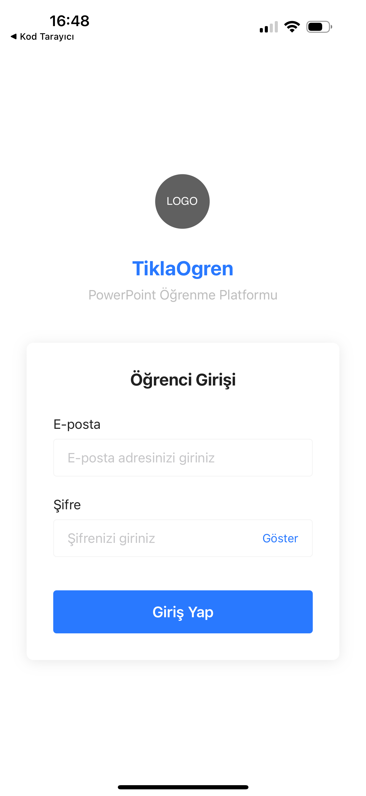
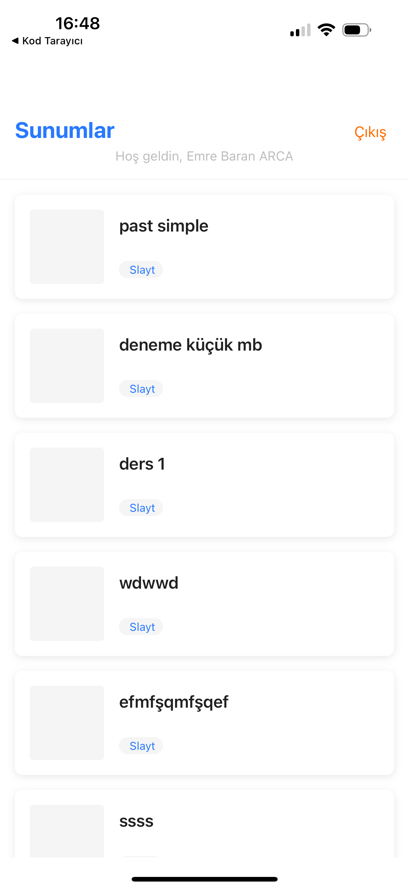
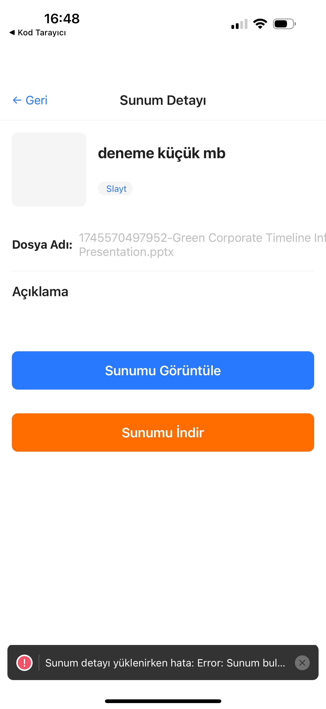
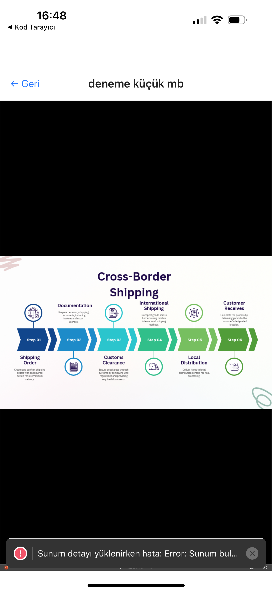

# 📚 SlideShareEdu - Technology in Education, Convenience for Teachers

SlideShareEdu is an open-source educational platform developed to help teachers easily and effectively share PowerPoint presentations with their students. This platform provides teachers with a web panel to manage their presentations and students with a mobile application to access these presentations.

---

## 🎯 Purpose and Objectives

- Provide **teachers** with the ability to manage their presentations in a centralized system
- Offer **students** access to course materials without time and space limitations
- **Track student participation and study habits**
- Provide an open-source and freely usable educational tool

---

## 🏗️ Project Architecture

SlideShareEdu consists of three main components:

### 1. Backend Server (`Express.js & MongoDB`)

The backend forms the backbone of the entire system and performs the following tasks:
- User authentication and authorization
- Storing and managing presentation files
- Collecting and reporting usage statistics
- Providing API for admin panel and mobile application

### 2. Web Management Panel (`React.js`)

Web interface developed for teachers and administrators:
- Upload and manage PowerPoint presentations
- Create and manage student accounts
- View usage statistics and reports
- Configure system settings

### 3. Mobile Application (`React Native`)

User-friendly mobile application developed for students:
- Login with student account
- View and download presentations
- Navigate forward and backward between slides
- View personal usage statistics

---

## 🚀 Installation

### Backend Installation

```bash
# Clone the project
git clone https://github.com/username/SlideShareEdu.git
cd SlideShareEdu/backend

# Install dependencies
npm install

# Create .env file (from example file)
cp .env.example .env

# Edit .env file and set necessary variables
# MongoDB connection details, JWT key, etc.

# Start the server
npm start
```

### Web Panel Installation
```bash
# Go to web panel directory
cd ../admin-panel

# Install dependencies
npm install

# Create .env file and set API URL
echo "REACT_APP_API_URL=http://localhost:3000/api" > .env

# Start development server
npm start

# Or build for production
npm run build
```

### Mobile Application Installation
```bash
# Go to mobile app directory
cd ../mobile-app

# Install dependencies
npm install

# Set API URL (edit the mobile-app/constants/config.js file)

# Start the application
npx expo start
```

## 📱 Mobile Application Features

- **Authentication**: Secure student login
- **Presentation Listing**: View all presentations assigned to the student
- **Presentation Viewing**: Open PowerPoint files directly within the application
- **Slide Navigation**: Navigate between slides with touch controls
- **Offline Access**: Download presentations and access without internet connection
- **Usage Statistics**: Automatically collect data such as number of slides viewed, time spent, etc.

## 💻 Web Panel Features

- **Dashboard**: General usage statistics and system status
- **Presentation Management**: Upload, edit, and delete PowerPoint files
- **Student Management**: Create, edit, and delete student accounts
- **Statistics**: Detailed usage reports and graphs
- **Settings**: System configuration and preferences

## 🔧 Technical Details

### Backend Technologies

- **Node.js & Express**: API server
- **MongoDB**: Database
- **JWT**: Authentication
- **bcrypt**: Password hashing
- **Multer**: File uploading

### Web Panel Technologies

- **React.js**: User interface
- **React Router**: Page routing
- **Axios**: API requests
- **CSS3**: Styling and layout

### Mobile Application Technologies

- **React Native**: Cross-platform mobile development
- **Expo**: Development and distribution tools
- **React Navigation**: Screen routing
- **Async Storage**: Local storage
- **FileSystem**: File operations

## 📊 Data Structure

### Users

- **Admin**: Manages presentations and creates student accounts
- **Student**: Views presentations and usage data is collected

### Presentations

- Information such as title, description, file path, upload date
- Number of slides and other metadata

### Usage Statistics (UsageStats)

- Which student viewed which presentation for how long
- Completion percentage and number of slides viewed

## 🚀 Contributing

SlideShareEdu is an open-source project and open to your contributions. To contribute:

1. Fork the project
2. Create a new branch (`git checkout -b feature/new-feature`)
3. Commit your changes (`git commit -m 'New feature: Description'`)
4. Push your branch (`git push origin feature/new-feature`)
5. Open a Pull Request

## 📝 License

This project is licensed under the [MIT License](LICENSE). For details, please review the license file.

## 📷 Screenshots

### Web Management Panel

#### Dashboard


### Mobile Application Screens

<p align="center">
  
  
  
  
</p>

## 📞 Contact

For questions or suggestions, please open an issue on GitHub or send a pull request.
